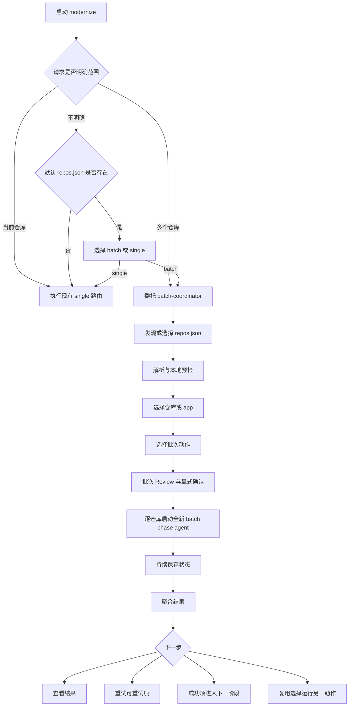
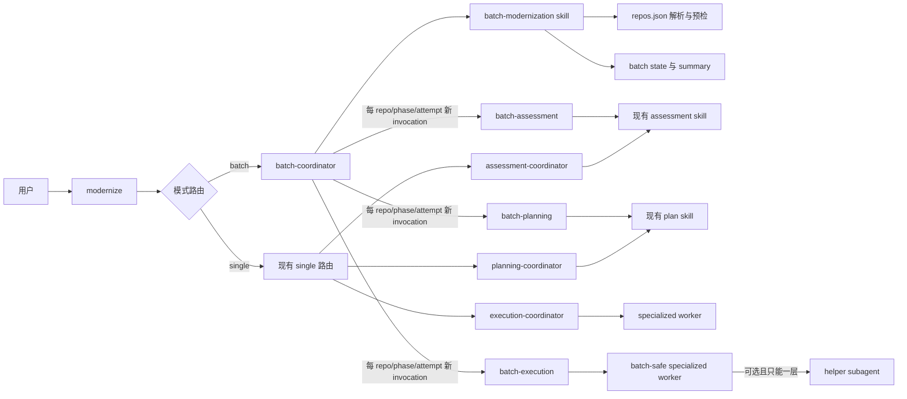

# Copilot CLI Modernization Plugin Batch Mode 设计方案

> 状态：设计草案
> 目标读者：准备使用或实现 Copilot CLI modernization plugin batch mode 的用户与实现者
> 范围：仅本地执行；只新增 batch mode；选择单仓库后不改变现有功能及其行为

## 1. 结论摘要

Batch mode 采用以下核心心智模型：

> 加载 `repos.json` → 选择仓库 → 选择动作 → 确认批次 → 查看逐仓库进度 → 处理结果

Copilot CLI 是对话式平台，batch mode 应实现为可恢复的批次工作台，而不是持续刷新的终端表格。

本方案作出以下关键决定：

1. Single-repository mode 与 batch mode 共享现有 `modernize` 用户入口，不新增用户可调用的 batch agent。Single 保留现有路由；batch 只额外委托一次内部 `batch-coordinator`。
2. 默认读取启动目录下的 `.github/modernize/repos.json`，同时允许用户指定其他 JSON 文件。
3. 同时支持 `repos.json` 的旧版数组格式和新版对象格式；核心仓库字段保持相同语义。
4. 只支持本地执行。远程 Git URL 仅用于克隆到本机，不代表云端委托。
5. 首次版本跨仓库顺序执行；`batch-coordinator` 为每个 `<repo, phase, attempt>` 启动全新的内部 batch phase agent invocation，真实工作复用现有 skills、scripts 和 specialized workers。
6. 启动前必须经过批次预检和显式确认，不因“默认全选”而直接开始。
7. 单仓库失败不终止整个批次；最终明确区分“完成”“完成但有问题”“失败”和“已暂停”。
8. `Ctrl+C` 或顶层 session 结束不保证还能写入 Paused；下次由用户重新进入 batch mode 并显式接管遗留 lease 后，才将没有终态的 Running invocation 推导为 Interrupted，并支持继续或重试可重试项。
9. 每个仓库继续使用现有 `.github/modernize/` 工件格式；batch 层只保存编排状态和聚合索引。
10. 不把模糊阶段压缩成统一的 `RUNNING`，也不存在把 `SUBMITTED` 当成成功的问题。

## 2. 当前产品边界确认

当前插件中的 assessment、planning 和 execution 都在本地工作区运行：

- Assessment 完全由 plugin 本地实现：Node runtime 运行 AppCAT/NCU和报告归一化，AI任务只来自 plugin-owned catalog；Assessment 不调用 MCP。
- Planning 通过当前 Copilot CLI 会话和本地 MCP server 生成计划。
- Execution 通过当前会话中的 coordinator 和 worker 修改本地工作区。
- 插件所称的 multi-agent 或 parallel execution，是当前 Copilot CLI 会话中的 agent 协作，不是 Cloud Agent 委托。

当前插件没有 Cloud Agent 作业提交、远端状态轮询、云端结果下载或 PR 会话恢复协议。因此，你对“插件目前只有本地执行”的判断是正确的。

Batch mode 不提供一个没有真实后端能力的 Cloud 选项。如果用户提出“Delegate to Cloud Agents”，应明确说明当前插件不支持，并让用户选择：

- 改为在本机执行；
- 取消本次批次。

不得静默降级为本地执行。

### 2.1 Copilot CLI 平台能力边界

本设计只依赖以下已验证能力：

- 主 agent 可以多次调用同一个 custom agent profile；每次调用都是临时 subagent invocation，并拥有独立 context window。
- Subagent 可以继续调用下层 subagent；当前实现基线的有效最大深度为 4。
- `user-invocable: false` 可以隐藏内部 agent，但内部 agent 仍可由父 agent 通过 `agent`/`task` tool 调用。
- 多个 invocation 共享同一个顶层 Copilot CLI session、目录授权和工具权限边界。

必须同时接受以下限制：

- Plugin 不能自主创建、切换或恢复顶层 Copilot CLI session。跨 session 恢复必须由用户再次启动或进入 `modernize`。
- Subagent invocation 不是持久化作业；顶层 session 终止后，不假设任何下层 invocation 仍然存活。
- `/fleet` 是宿主交互能力，不是 plugin custom agent 的调度 API，本设计不依赖 Fleet。
- 位于启动目录之外的仓库不会自动获得访问权限；用户必须通过宿主路径授权（例如 `/add-dir`、`--add-dir` 或权限对话框）授权后才能执行。
- 深层 subagent 的 MCP/extension tool 可见性受父级工具集合约束。每个父 agent 的工具集合必须覆盖其所有直接子 agent 所需工具，并通过真实链路测试验证。

Batch 主链固定为：

```text
modernize                         depth 0
└── batch-coordinator             depth 1
  └── batch phase agent         depth 2
    └── specialized worker    depth 3（Execution 需要时）
      └── optional helper   depth 4（禁止继续派生）
```

任何会达到 depth 5 的工作流都不得进入 batch。首版明确排除现有 rearchitecture 执行路径，直到它具备不超过 depth 4 的专用路由或停止在 worker 中继续派生 subagent。

## 3. 用户目标

### 3.1 必须提供的能力

Batch mode 必须提供：

- 默认配置位置：`.github/modernize/repos.json`；
- URL 与本地绝对路径两种仓库输入；
- 远程仓库默认落盘到 `{启动目录}/repos/{name}`；
- 仓库多选和“全选”能力；
- 批量 assessment；
- 对多个仓库应用同一个升级或迁移目标；
- 单仓库失败后继续处理其他仓库；
- 逐仓库状态和最终聚合摘要；
- Assessment 后继续 Planning，Planning 后继续 Execution 的工作流。

### 3.2 必须避免的体验

不得出现以下体验：

- 检测到 `repos.json`，却仍默认进入当前目录单仓流程；
- 默认全选后按一次确认键就立刻启动高成本批次；
- 从配置中只选一个仓库后丢失 batch 上下文；
- 只显示 `RUNNING`，无法区分克隆、评估、规划和执行；
- 失败原因只存在于日志；
- 中断后只能从头开始；
- 部分失败仍显示成笼统的成功；
- 完成后只能回主菜单，不能复用刚才的仓库选择；
- 已存在目录被自动 stash、删除或重新克隆，而用户事前不知情。

## 4. 入口设计

### 4.1 单一用户入口与 Batch 路由

继续使用现有用户入口，不新增 `modernize-batch` agent：

```text
github-copilot-modernization:modernize
```

典型启动方式：

```bash
cd /path/to/portfolio-workspace
copilot --agent=github-copilot-modernization:modernize
```

用户可以直接说：

```text
评估 repos.json 中的所有仓库
```

```text
把选中的 Java 仓库升级到 Java 21
```

```text
继续上次未完成的批次
```

`modernize` 是唯一面向用户的入口：

- Single-repository mode → 继续执行现有 Assessment、Planning 和 Execution 路由；
- Batch mode → 只委托一次内部 `batch-coordinator`。

`batch-coordinator` 设置 `user-invocable: false`，负责配置、选择、批次确认、逐仓库调度、状态恢复与结果聚合。用户无需知道其名称，也无需退出当前 session 或改用其他入口。

在现有 Assessment、Planning 和 Execution 意图路由之前，按以下优先级确定模式：

1. 用户明确提到 `repos.json`、所有仓库、多个仓库、选中的仓库或继续某个批次时，直接进入 batch mode。
2. 用户明确要求处理当前仓库、这个应用或单个仓库时，进入现有 single-repository mode。
3. 用户意图没有明确范围，但启动目录下存在 `.github/modernize/repos.json` 时，展示结构化选择界面：
  - **处理 `repos.json` 中的多个仓库**；
  - **只处理当前仓库**。
4. 用户意图没有明确范围且默认配置不存在时，保持现有 single-repository mode，不增加额外提示。

模式选择只确定工作范围，不代表批准执行。选择 batch mode 后，`modernize` 把请求委托给 `batch-coordinator`，后者仍必须经过仓库选择、批次预检和 Start batch 确认。选择 single-repository mode 后，继续执行当前工作流。

同一会话一旦确定模式，后续阶段沿用该模式，除非用户明确要求切换。Headless 请求无法展示选择界面；当请求范围不明确且检测到默认配置时，应停止并要求调用方明确指定 single 或 batch，不得静默选择。

### 4.2 配置发现

进入 batch mode 后，`batch-coordinator` 按以下顺序确定配置：

1. 用户在请求中明确指定的 JSON 路径；
2. 启动目录下的 `.github/modernize/repos.json`；
3. 如果两者都没有，询问用户提供路径；只有用户明确放弃 batch 后才返回 single-repository mode。

即使检测到默认配置，也只自动“加载并预检”，不自动开始执行。

## 5. `repos.json` 规范与兼容

### 5.1 兼容定义

“兼容已有 `repos.json`”分为三个层次：

1. **加载兼容**：现有 v1/v2 文件无需修改即可被 `batch-modernization` skill 读取。
2. **核心执行兼容**：`name`、`url`、`path`、`branch`、`include_paths` 和 `apps` 保持可预测的对应语义。
3. **扩展能力透明降级**：插件没有的输出分发能力必须明确提示，不得静默执行或静默丢弃。

### 5.2 旧版 v1 格式

继续支持数组格式：

```json
[
  {
    "name": "orders-api",
    "url": "https://github.com/contoso/orders-api.git"
  },
  {
    "name": "billing-worker",
    "url": "git@github.com:contoso/billing-worker.git"
  }
]
```

V1 只支持 `name + url`。加载时提示这是旧格式，但不要求用户先迁移文件。

### 5.3 新版 v2 格式

```json
{
  "producer": "portfolio-team",
  "repos": [
    {
      "name": "orders-api",
      "url": "https://github.com/contoso/orders-api.git",
      "branch": "main",
      "include_paths": ["src/orders"]
    },
    {
      "name": "local-worker",
      "path": "C:\\src\\local-worker"
    }
  ],
  "apps": [
    {
      "identifier": "commerce",
      "repos": ["orders-api", "local-worker"]
    }
  ]
}
```

### 5.4 字段兼容矩阵

| 字段 | Batch mode 行为 |
|---|---|
| `name` | 必填；作为稳定仓库标识、显示名称、状态键和默认目录名。大小写不敏感地唯一。 |
| `url` | 支持 HTTPS 和 SSH Git URL；拒绝明文 HTTP。仓库克隆到本机后执行。 |
| `path` | 支持已有本地目录；必须是绝对路径，`~` 可展开为用户目录。启动目录之外的路径必须先通过宿主路径授权，未授权时标记 Blocked 并提示使用 `/add-dir`、`--add-dir` 或权限对话框。 |
| `url` 与 `path` 同时存在 | 使用 `url`，并在预检中显示警告。 |
| `branch` | 仅对 `url` 生效；本地 `path` 中出现时显示“已忽略”警告。 |
| `include_paths` | 接受仓库内相对路径；禁止越出仓库根目录。具体处理见下节。 |
| `apps` | 用于按应用筛选仓库、分组显示结果和生成应用级汇总。 |
| `producer` | 保留在批次 manifest 中，用于来源追踪，不影响执行。 |
| `project_id` / `component_id` | 作为不透明关联元数据保留，不参与首版执行决策。 |
| `apps[].output` | 文件仍可加载，但首版不执行 local、git 或 AzureMigrateStorage 分发；启动前明确提示。 |
| 未识别字段 | 保留在配置快照中并给出提示，不因向前兼容字段而拒绝整个文件。 |

### 5.5 `include_paths` 行为

为保持明确的 workspace 和范围语义，同时不修改现有单仓库 assessment：

- 如果仓库根目录本身可识别为项目，仍以仓库根目录为 workspace，并把 `include_paths` 作为显式范围约束传给该仓库的工作流。
- 如果根目录不是项目，但 `include_paths` 指向一个或多个可识别项目，则每个有效路径成为独立执行单元，显示为 `仓库名/相对路径`。
- 不存在、越界或不包含受支持项目的路径在预检中列出，不静默跳过。
- Planning 和 Execution 必须继承同一范围约束，避免 Assessment 看一个子目录、Execution 却修改整个仓库而没有提示。

### 5.6 App 分组

`apps` 不改变仓库的物理工作区。它只用于：

- 用户按应用选择仓库；
- 进度和结果按应用分组；
- 在最终摘要中显示应用覆盖情况；
- 识别未被任何 app 引用的 orphan repos，并给出非阻塞警告。

一个仓库可以属于多个 app，但整个批次中只执行一次。

### 5.7 URL 到本地路径的映射

采用以下确定性路径映射规则：

```text
批次根目录：启动 Copilot CLI 时的当前目录
克隆根目录：{批次根目录}/repos
目标目录：  {批次根目录}/repos/{清洗后的 name}
```

例如：

```text
启动目录：C:\work\modernization
name：orders-api
url：https://github.com/contoso/commerce.git

本地目录：C:\work\modernization\repos\orders-api
```

映射依据是配置中的 `name`，不是 URL 的最后一段。

目录名清洗规则为：非法文件名字符替换为 `-`，连续 `-` 合并，并去掉首尾 `-`。所有清洗后的路径也必须唯一；发生碰撞时在克隆前阻止批次。

### 5.8 已存在目录的安全策略

默认安全策略禁止自动 stash、删除已有目录、改写 origin 或重新克隆已有工作区。

| 本地状态 | 默认行为 |
|---|---|
| 目标不存在 | 克隆 URL，并检出指定分支或远端默认分支。 |
| 是 Git 仓库、origin 匹配、工作区干净 | 标记 Ready；显示当前分支和 commit。 |
| 是 Git 仓库但有本地修改 | 标记 Needs attention；Assessment 可经确认后使用，Execution 默认阻止。 |
| origin 与配置 URL 不一致 | 阻止，不自动改写 origin。 |
| 目录存在但不是 Git 仓库 | 阻止，不自动删除。 |
| 指定分支无法检出 | 仅该仓库失败，其他 Ready 仓库仍可继续。 |

Batch mode 永远不应在批次预检之外自动 stash、删除目录、覆盖本地改动或切换有冲突的分支。

## 6. 用户流程



### 6.1 第一步：配置与预检

加载配置后先显示：

```text
已加载 .github/modernize/repos.json

仓库             12
Ready            9
Needs attention  2
Blocked          1
执行位置         本机
克隆目录         C:\work\modernization\repos
```

预检至少覆盖：

- JSON 结构和仓库名唯一性；
- URL、绝对路径和分支格式；
- 本地目录是否存在；
- 克隆目标冲突；
- Git origin、当前分支和工作区是否干净；
- 本地路径是否位于当前 session 已授权的目录范围内；
- 支持的项目语言；
- `include_paths` 是否存在且未越界；
- 配置中的能力是否超出插件支持范围。

结构性错误，例如 JSON 损坏、冲突仓库名或 app 引用了不存在的 repo，应阻止整个批次。环境性问题，例如单个本地路径缺失或单个仓库认证失败，只阻止对应仓库。

### 6.2 第二步：仓库选择

默认选中所有 Ready 仓库，但这不等于授权开始执行。

用户可以：

- 全选 Ready 仓库；
- 按 app 选择；
- 指定仓库名；
- 排除 Needs attention 或不适用于当前动作的仓库；
- 查看被阻止仓库的原因。

从配置中只选择一个仓库时，仍保留 batch 上下文、批次状态和批次完成菜单。

对于较大配置，不在一条问题中罗列几十个复选项。优先提供“全部 Ready”“按 app”“按名称指定”“查看异常项”，再按需展开。

### 6.3 第三步：批次动作

提供四类动作：

1. **批量 Assessment**：对所有选中仓库使用同一评估意图和组配置。
2. **应用同一个明确任务**：例如“升级到 Java 21”或“修复高危 CVE”，对所有适用仓库执行同一目标。
3. **完整 Modernization**：Assessment → Planning → Execution，阶段之间保留批次级确认点。
4. **执行受支持的已有计划**：为每个仓库查找已有 plan，只执行语言、任务类型和调用深度均受 batch 支持的计划；缺少计划的仓库标记 Needs attention，包含 rearchitecture 等超深任务的计划标记 Not supported。

首版不提供 Local / Cloud 二选一，因为唯一真实选项就是本机。Review 页面固定显示“执行位置：本机”。

### 6.4 第四步：批次 Review

任何实际工作开始前，都显示一次稳定摘要：

```text
批量升级到 Java 21

选中仓库       8
可执行          6
不适用          1  (.NET)
需要处理        1  (工作区有未提交修改)
执行位置        本机
执行顺序        顺序执行
上下文隔离      每仓库、每阶段使用新的 batch phase agent
结果目录        .github/modernize/batches/20260812-143000-java21

选择：
1. 开始 6 个 Ready 仓库
2. 处理异常项
3. 修改选择
4. 取消
```

这个确认是批次授权边界。Assessment 可以在确认后以现有 headless 模式逐仓执行，不再对每个仓库重复询问相同的评估意图和组选择。

Execution 的授权更严格：

- 交互模式下，Planning 完成后必须再显示一次所有仓库的计划摘要，用户确认后才进入 Execution。
- 只有用户请求中明确包含“执行”且启动前 Review 已展示完整影响范围，才可在 headless 请求中跳过阶段间确认。
- `--allow-all`、`--allow-all-tools`、路径授权和其他宿主权限设置只控制工具权限，不代表用户批准 Assessment、Planning 或 Execution。
- “评估这些仓库”绝不能被解释为允许修改代码。

### 6.5 第五步：运行中反馈

Copilot CLI 中使用简洁、追加式的状态更新，不模拟持续重绘的 TUI dashboard。

顶部概念摘要：

```text
Batch assessment · 6/12 已结束
完成 5 · 完成但有问题 1 · 运行中 1 · 等待 4 · 失败 1
```

逐仓库事件：

```text
[4/12] orders-api · Assessing
[4/12] orders-api · Completed with issues · 2 个检查失败
[5/12] billing-worker · Preparing
```

状态必须反映真实阶段：

- Pending
- Preparing
- Assessing
- Planning
- Executing
- Needs input
- Completed
- Completed with issues
- ProtocolError
- Failed
- Skipped
- Interrupted

完成百分比只按终态仓库计算，并且只能单调增加。`Preparing`、`Assessing`、`Planning` 和 `Executing` 不计入完成数。

### 6.6 第六步：完成与下一步

最终结果不能只说“成功”或只返回主菜单：

```text
批次完成，但有问题

总计             12
完成              8
完成但有问题       2
失败              1
跳过              1

失败：
- legacy-web · 未检测到受支持的项目

完成但有问题：
- orders-api · AppCAT 不可用，其他 assessment 组已完成

摘要：.github/modernize/batches/20260812-143000-assess/summary.md
```

随后提供：

- 查看批次摘要；
- 查看失败仓库；
- 只重试 Completed with issues、ProtocolError、Failed 或 Interrupted 仓库；
- 让成功仓库进入下一阶段；
- 对同一批仓库运行另一个动作；
- 修改仓库选择；
- 结束。

## 7. Assessment、Planning、Execution 的批次语义

### 7.1 Batch Assessment

用户在批次级选择 domains 与 coverage：

- Domains：Security、Cloud readiness、Java upgrade；
- Coverage：Issue only 或 Full。

`batch-coordinator` 为每个仓库启动新的内部 `batch-assessment` agent，并传入同一意图和绝对 `project-path`。该 agent 的静态工具列表不包含 `ask_user`，并以 batch-headless 模式调用 assessment skill。每个仓库仍生成现有两类报告：

- 交互 HTML 报告；
- 供 Planning 使用的 compatibility `report.json`。

Java、.NET 和 JavaScript/TypeScript 都可 Assessment。JavaScript/TypeScript-only 仓库在结果中明确标记“Assessment 完成，Planning/Execution 当前不支持”，这不是 Assessment 失败。

`batch-assessment` 只消费本地 `assessment-catalog.mjs` 生成的计划：

- AppCAT/NCU 确定性任务不创建 AI subagent；
- Full coverage 创建一个 6-task facts 批次；
- Security 创建一个 7-task 批次（1 CVE + 6 CWE categories）；
- 同时选择 Full 与 Security 时两个批次顺序执行，不合并为 13 路。

因此单仓 Assessment 的最大 subagent 并发为 7。不存在固定 12-subagent pool，也不再支持任意 granular `fact-*` 或 custom skill group选择。

### 7.2 Batch Planning

Planning 阶段由 `batch-coordinator` 逐仓库启动新的内部 `batch-planning` agent。该 agent 的静态工具列表不包含 `ask_user`，并复用 plan skill：

- 从该仓库最新一次成功 Assessment 的 `report.json` 创建计划；或
- 对多个明确任务创建计划。

批次层不合并不同仓库的 `plan.md`，也不创建一个跨仓库 tasks 文件。每个计划仍属于自己的仓库。

如果某仓库出现替代方案、约束冲突、覆盖确认或其他需要用户决策的情况，`batch-planning` 写入结构化 `NeedsInput` 结果并结束。其他仓库可以继续 Planning；待本轮结束后由 `batch-coordinator` 集中提问。

### 7.3 Batch Execution

Execution 阶段由 `batch-coordinator` 逐仓库启动新的内部 `batch-execution` agent。它复用 execution routing 规则并调用 batch-safe specialized worker：

- 每个仓库使用自己的 workspace 和 plan；
- `modernize` 只负责模式路由和呈现批次级结果；
- `batch-coordinator` 只负责批次控制平面，不读取或修改应用源码；
- `batch-execution` 和 batch-safe specialized worker 完成真实工作。

任何下层 worker 若需要目标版本、方案选择、dirty workspace 策略、计划确认或其他用户输入，必须向 `batch-execution` 返回 `NeedsInput`，再由其写入该 attempt 的结构化结果。`batch-execution` 的静态工具列表必须包含所有直接子 worker 所需工具，但明确排除 `ask_user`；该父级过滤同时使其子 worker 无法直接提问。

首版跨仓库顺序执行，但顺序执行不等于复用同一个下层 context。每个 `<repo, phase, attempt>` 都是新的 batch phase agent invocation；调用返回后，其 context 不再作为后续仓库的输入。Batch-safe worker 在单个仓库内部是否并行不受仓库级顺序影响，但整条调用链不得超过 depth 4。

### 7.4 对所有仓库应用同一个明确任务

这是对所有适用仓库执行同一明确任务的标准路径。

例如用户输入：

```text
将 repos.json 中所有 Java 项目升级到 Java 21
```

预检先按适用性分类：

- Java：Ready；
- .NET：Not applicable，默认 Skipped；
- JavaScript/TypeScript：Not applicable，默认 Skipped；
- 无法检测：Needs attention。

不应先按第一个仓库推断整批语言，再让后续仓库运行到中途才失败。

### 7.5 上下文隔离与结果工件契约

单一用户入口不等于单一执行 context。Batch mode 使用以下层级：

1. `modernize` 只保留模式选择和一次 batch 委托；
2. `batch-coordinator` 只保留批次状态索引、用户决策和当前调度选择；
3. 每个 `<repo, phase, attempt>` 使用新的 batch phase agent invocation；
4. Execution coordinator 可以调用 specialized worker；worker 最多再调用一层 helper；
5. 完整报告、计划、日志和代码分析只写入工件，不沿调用链逐层复制。

`batch-coordinator` 调用 batch phase agent 时至少传入：

```json
{
  "batchId": "20260812-143000-assess",
  "invocationId": "4f7e6f2d-8e4f-4e7d-a5d4-3ab29ed8dd3d",
  "repoId": "orders-api",
  "workspacePath": "/work/repos/orders-api",
  "phase": "assessment",
  "attempt": 1,
  "mode": "batch-headless",
  "userRequest": "评估选中的仓库",
  "phaseApproved": true,
  "leaseToken": "<ephemeral-owner-token>",
  "resultPath": "/work/.github/modernize/batches/20260812-143000-assess/attempts/orders-api/assessment/1/result.json"
}
```

Batch phase agent 的请求只包含已解析的单仓输入，不包含 `repos.json` 内容或配置路径。它只能按请求处理指定 workspace、phase 和 attempt，不得自行发现或扩大仓库选择，也不得重复批次级确认。结束前必须通过 `batch-state.mjs record-result` 写入 `resultPath`；不得手工编辑 batch state。

这是逻辑作用域，不是独立文件系统沙箱：subagent 仍继承顶层 session 的目录授权。安全边界由宿主路径权限提供；batch 通过最小输入、agent 指令和 result artifact 路径验证防止意外扩大执行范围，不承诺对已授权文件提供保密隔离。

结果文件使用固定 schema：

```json
{
  "schemaVersion": 1,
  "batchId": "20260812-143000-assess",
  "invocationId": "4f7e6f2d-8e4f-4e7d-a5d4-3ab29ed8dd3d",
  "repoId": "orders-api",
  "phase": "assessment",
  "attempt": 1,
  "status": "completed_with_issues",
  "artifacts": {
    "report": "/work/repos/orders-api/.github/modernize/assessment/reports/report-123/report.json",
    "html": "/work/repos/orders-api/.github/modernize/reports/123-full-audit.html"
  },
  "evidence": {
    "artifactValidation": "passed",
    "high": 2,
    "medium": 5
  },
  "needsInput": null,
  "error": null
}
```

Subagent 的自然语言返回不是状态真源，也不要求宿主把它当作严格 JSON。它只应返回一条紧凑通知，表示父 agent 可以读取 `resultPath`。收到 subagent 完成通知后，`batch-coordinator` 必须调用确定性脚本执行以下步骤：

1. 校验 result schema、batch/invocation/repo/phase/attempt 标识和状态枚举；
2. 校验所有工件路径位于预期 batch root 或目标 workspace 内；
3. 按 phase 检查证据：
   - Assessment：HTML 与 compatibility `report.json` 存在且可解析；
  - Planning：`plan.md` 与一个可解析的 tasks 文件存在；tasks 文件可位于计划根目录的 `tasks.json` 或 `.metadata/tasks.json`；
   - Execution：任务终态、summary、build/test 或明确豁免证据与 success criteria 一致；
4. 只有验证通过后，才原子提交仓库终态并调度下一个仓库。

结果文件缺失、schema 非法、标识不匹配、工件不存在或仅有“worker 返回成功”而没有证据时，attempt 必须进入 `ProtocolError`，不得标记 Completed。完整 findings、计划正文、构建日志、diff 和下层原始返回保留在工件中，不写入 result 文件。

若需要用户决策，batch phase agent 写入 `status: needs_input` 和结构化 `needsInput` 后结束。`batch-coordinator` 在当前轮次结束后集中提问，将答案写入批次状态，再创建新的 attempt 和新的 batch phase agent context。所有 batch phase agent 的静态工具列表都必须排除 `ask_user`；共享 skill 中的交互分支在 `batch-headless` 下必须转换为 `NeedsInput`。

## 8. 批次状态与恢复

### 8.1 批次目录

在启动目录保存新增的 batch 工件：

```text
.github/modernize/batches/<batch-id>/
├── manifest.json          # 不可变的批次输入快照
├── lease.json             # 当前唯一写入者；正常结束时删除
├── state.json             # 当前批次与逐仓库状态
├── events.jsonl           # 追加式状态事件，便于排障
├── summary.json           # 结构化最终摘要
├── summary.md             # 用户可读索引和结果链接
├── attempts/
│   └── orders-api/assessment/1/result.json
└── repos/
    ├── orders-api.json    # 逐仓库阶段、错误与工件链接
    └── billing-worker.json
```

`manifest.json` 至少记录：

- batch ID、创建时间和本地执行模式；
- 配置文件绝对路径及内容哈希；
- `producer` 和其他关联元数据；
- 用户选择的仓库和 app；
- 每个仓库的 URL/path/branch/include paths 快照；
- 动作、Assessment 意图或明确 modernization 任务；
- URL 到本地 workspace 的解析结果；
- phase 请求、attempt result 和 batch state 的 schema 版本。

不得写入访问令牌、凭据或 URL 中的秘密查询参数。

`state.json` 和 `repos/<repo>.json` 必须记录当前 phase、attempt、唯一 invocation ID、开始时间、终态时间和工件路径。调度幂等键为 `<batchId, repoId, phase, attempt>`：派发前先持久化 Running 事件，收到并验证合法 result artifact 后再原子写入终态。所有 JSON 更新采用“写临时文件、flush、原子替换”，events 只允许在持有 lease 时追加。

### 8.2 独占 Lease

同一批次任意时刻只能有一个 `batch-coordinator` 写入。`batch-state.mjs acquire-lease` 必须使用原子 exclusive create 创建 `lease.json`，返回随机 owner token；后续所有状态变更命令都必须提交该 token。Lease 至少记录 owner token 哈希、acquiredAt、lastHeartbeat 和当前 invocation ID。

- 原始 owner token 不写入 batch 工件。若当前 coordinator 因 compaction 或其他原因无法再提供 token，状态写入必须 fail closed，并要求用户显式接管；不得从哈希恢复或绕过校验。
- 已存在其他 owner 的 lease 时，新 session 只能查看状态，不能恢复、重试或修改批次。
- 不允许仅因时间过去而自动抢占 lease。长时间 subagent 运行可能没有 heartbeat，时间不能证明 owner 已死亡。
- 用户明确选择“接管”后，脚本才可以旧 lease digest 为前置条件执行 compare-and-swap 并轮换 owner token；并发 takeover 只有一个成功。接管操作把所有无终态 Running invocation 推导为 Interrupted，并记录 takeover 事件。
- 正常暂停、取消或完成时释放 lease。进程崩溃、`Ctrl+C` 或顶层 session 强制结束后可能留下 lease，这是预期状态。
- Batch state 和 lease 是协作式并发控制，不用于抵御拥有本机文件访问权限的恶意进程。

### 8.3 每仓库工件不迁移

现有单仓库工件继续写在对应仓库内：

```text
<repo>/.github/modernize/
├── .memory/
├── reports/
├── assessment/reports/
└── <plan-name>/
    ├── plan.md
  ├── tasks.json                 # 兼容位置，可不存在
  └── .metadata/tasks.json       # 兼容位置，可不存在
```

一个有效计划必须在上述两个位置之一包含 tasks 文件。若两处同时存在且内容不同，标记 Needs input，不得静默选择其中一份；解析后把实际使用的绝对路径写入 result artifact。

Batch summary 只链接这些工件，不复制、不重命名、不改写其内容。这样 single-repository workflow、报告页面、Planning 和 Execution 仍可独立使用。

### 8.4 中断与继续

在每个状态转换前后持久化事件。正常暂停只允许发生在两个 invocation 之间。若用户在 batch phase agent 运行期间请求暂停，`batch-coordinator` 记录“pause requested”，等待当前 invocation 自然结束并验证结果后，不再派发下一个仓库。到达暂停检查点时：

- 当前批次标记为 Paused；
- 已完成仓库保持 Completed；
- 当前没有 Running invocation；
- 尚未开始的仓库保持 Pending；
- 释放 lease。

若用户需要立即停止正在运行的 subagent，只能中断顶层操作；这属于非正常中断，不保证写入 Paused。`Ctrl+C`、进程崩溃或顶层 session 强制结束后，用户在后续 Copilot CLI session 中再次进入 batch mode，新的 `batch-coordinator` 只从 manifest、state、events 和逐仓库工件重建调度状态；若检测到遗留 lease，必须先让用户选择“只查看”或“接管”。接管后，为待继续的 `<repo, phase, attempt>` 创建新的 batch phase agent invocation，不恢复旧 subagent。

下次通过 `modernize` 进入 batch mode 时，如果发现未结束批次，优先提供：

1. 继续剩余仓库；
2. 只重试 Completed with issues、ProtocolError、Failed 或 Interrupted 仓库；
3. 查看上次状态；
4. 放弃旧批次并创建新批次。

恢复前重新检查：

- `repos.json` 是否变化；
- URL/path/branch 映射是否变化；
- 本地 workspace 是否仍存在；
- Execution 场景下 HEAD 和工作区状态是否变化；
- 所需 Assessment 或 Plan 工件是否仍存在。

发现变化时，不自动沿用旧结论。显示差异并让用户决定继续、重新运行该仓库或排除它。

### 8.5 重试规则

- 默认只重试 Completed with issues、ProtocolError、Failed 或 Interrupted 仓库。
- Completed 仓库默认跳过，除非用户明确要求重新运行。
- Assessment 重试可以生成新报告，不覆盖旧报告。
- Planning 重试可以生成新计划版本或经确认覆盖同名计划。
- Deployment 当前使用固定仓库级工件路径；在改为 attempt-scoped 之前，不支持 batch 自动重试。
- Rearchitecture 在首版中为 Not supported，从不进入执行或重试集合。
- Execution 重试必须显示现有代码改动和上次失败阶段，不能假设仓库仍处于初始状态。

## 9. 结果语义

### 9.1 仓库级结果

| 结果 | 含义 |
|---|---|
| Completed | 该动作的必要步骤均成功。 |
| Completed with issues | 产生了可用结果，但存在降级、检查失败或未完成的非阻塞部分。 |
| Failed | 未产生该动作要求的可用结果。 |
| ProtocolError | Phase agent 已结束，但结果文件、schema 或必要工件证据无效。不得折算为成功。 |
| Needs input | 需要用户决策；当前 attempt 已结束，回答后创建新 attempt。 |
| Skipped | 用户排除、不适用或前置条件不满足，且未尝试执行。 |
| Interrupted | Attempt 没有终态，并在显式 takeover 时由遗留 Running 状态推导，可用新 attempt 恢复。 |

失败原因必须同时出现在聊天摘要和 `summary.md` 中，不能要求用户去日志中寻找第一个线索。

### 9.2 批次级结果

| 批次结果 | 判定 |
|---|---|
| Completed | 所有实际执行的仓库均 Completed。 |
| Completed with issues | 至少一个仓库可用，但存在 Completed with issues、ProtocolError、Failed 或 Skipped。 |
| Failed | 没有任何仓库产生可用结果，或批次在执行前因结构性错误被阻止。 |
| Paused | 用户请求暂停，且 coordinator 已在 invocation 边界完成状态写入并释放 lease；仍有 Pending 仓库可继续。 |
| Cancelled | 用户明确放弃并关闭批次，不等同于简单中断。 |

Assessment、Planning 和 Execution 使用同一套聚合规则，不再出现一种动作部分失败返回成功、另一种动作部分失败返回失败的用户语义差异。

## 10. 增量实现边界

### 10.1 修改与新增组件

保留现有单仓编排职责，只新增内部 batch 控制层：

```text
agents/
├── modernize.agent.md                  # 修改：在现有路由前增加 single/batch 路由
├── batch-coordinator.agent.md          # 新增：内部批次调度，user-invocable: false
├── batch-assessment.agent.md           # 新增：无 ask_user 的 Assessment phase agent
├── batch-planning.agent.md             # 新增：无 ask_user 的 Planning phase agent
└── batch-execution.agent.md            # 新增：无 ask_user 的 Execution phase agent

skills/
└── batch-modernization/
    ├── SKILL.md
    ├── references/
  │   ├── phase-contract.md
  │   └── repos-json-compatibility.md
  ├── schemas/
  │   └── attempt-result.schema.json
    └── scripts/
        ├── resolve-repos.mjs
        ├── inspect-workspaces.mjs
    ├── validate-result.mjs
    └── batch-state.mjs

docs/
└── BATCH_MODE_DESIGN.md
```

职责划分：

| 组件 | 只负责 |
|---|---|
| `modernize` | 识别 single/batch 范围；single 走现有路由，batch 只委托一次内部 coordinator。 |
| `batch-coordinator` | 配置选择、批次确认、lease、逐仓库串行调度、结果收集、用户交互、恢复和聚合摘要。 |
| `batch-assessment` | 无交互地运行一个仓库的 Assessment；复用 assessment skill。 |
| `batch-planning` | 无交互地生成或检查一个仓库的 plan；复用 planning skills。 |
| `batch-execution` | 无交互地路由一个仓库的受支持执行任务并收集证据。 |
| `batch-modernization` | 提供确定性的配置解析、workspace 预检、状态读写和摘要生成能力，不调用业务 coordinator。 |
| `resolve-repos.mjs` | 以确定性规则解析和验证 `repos.json`，输出结构化结果。 |
| `inspect-workspaces.mjs` | 检查本地路径、Git origin、分支、HEAD 和 dirty 状态，不修改工作区。 |
| `validate-result.mjs` | 校验 attempt result schema、路径边界、phase 工件和成功证据。 |
| `batch-state.mjs` | 获取/接管 lease，原子更新 manifest/state/event/summary，提供 resume/retry 查询。 |
| Batch-safe specialized workers | 在父级过滤掉 `ask_user` 后执行；需要决策时返回 `NeedsInput`。 |

### 10.2 必须修改与保持不变

必须修改：

- `modernize.agent.md`：增加模式路由；其现有 single-repository 状态机和防重规则不用于 batch 内部循环。
- Assessment skill：明确 `batch-headless` 覆盖所有 HITL 规则，并由 `batch-assessment` 写入 result artifact。
- Plan skill 和 list-plans skill：batch 中不直接提问、不隐式选择、不覆盖计划；由 `batch-planning` 返回 `NeedsInput` 或 attempt-scoped 计划。
- Execution routing 规则：提取为 single 与 batch 可共同消费的共享规则；`batch-execution` 不能把 worker 文本返回视为成功，必须按 success criteria 生成可验证证据。
- 进入 batch 的 worker：不得在 depth 2+ 直接提问；固定工件路径必须改为 attempt-scoped，或者明确禁用自动重试。

保持不变：

- `plugin.json` 的 agent 入口；
- `.mcp.json`；
- 现有 SessionStart hook；
- single-repository mode 的用户可见路由、确认和工件格式。

现有 assessment coordinator 已支持传入绝对 `project-path`，并可从启动目录已安装的 runtime bootstrap 目标仓库。Batch Assessment 必须保留这个显式 bootstrap，不能假设 SubagentStart 会重新执行 plugin SessionStart。

当前 `modernize` 中按 coordinator 名称阻止重复调用的规则只适用于 single mode。`modernize` 对 batch 只调用一次 `batch-coordinator`；batch 内部的调度、重试和恢复使用持久化键 `<batchId, repoId, phase, attempt>`，不读取 `modernize` 的 todo 作为状态真源。

### 10.3 调用关系



`modernize` 是 single/batch 的统一用户入口。`batch-coordinator` 只负责编排，不应自己评估代码、生成计划、修改应用代码或运行 build/test；batch 的真实工作委托给 batch phase agents 和 batch-safe workers。

### 10.4 嵌套深度硬门槛

Batch 调用深度固定为：

```text
modernize                         depth 0
└── batch-coordinator             depth 1
  └── batch phase agent         depth 2
    └── specialized worker    depth 3
      └── optional helper   depth 4
```

兼容基线按最大 depth 4 设计，不依赖用户调高宿主限制。任何 depth 4 agent 都不得继续调用 subagent；任何可能达到 depth 5 的任务在预检时标记 Not supported。当前 rearchitecture 路径会超过该上限，因此不属于首版 batch 范围。

每个父 agent 的 `tools` 必须覆盖其直接子 agent 所需工具；batch phase agent 同时静态排除 `ask_user`。由于深层 MCP/extension tool 继承对父级工具集合敏感，实现测试必须包含一次 depth 4 plugin MCP 探针和一次同名 batch phase agent 串行重复调用。探针失败时阻止对应 batch 动作，不允许退化为父 agent 自己执行真实工作。

## 11. 调度顺序、上下文与资源策略

首版仓库级顺序执行。这里的“顺序”只描述调度顺序，不表示多个仓库共享一个 agent context；每次调度仍创建新的 batch phase agent invocation。选择顺序执行的原因是：

- 提供可预测且资源可控的首版行为；
- 避免多个仓库同时占用大量 CPU、内存和网络；
- 避免多个子 agent 的输出交错，使状态难以理解；
- Execution 本身可能修改分支、依赖和构建缓存，顺序执行更容易恢复；
- 单仓库内部的现有并行策略无需改变。

`batch-coordinator` 只累积固定大小的验证结果和工件路径，并在每次调用后将权威状态写入磁盘；它不能把前一个仓库的自然语言返回拼接进下一个仓库的 prompt。批次是否能在一个顶层 session 内全部结束不是正确性条件。

后续可以只对 Assessment 增加有上限的并发，但必须满足：

- 用户能看到并发上限；
- 同一 Git root 下的执行单元保持串行；
- 状态写入彼此隔离；
- 并发不改变结果和恢复语义。

Execution 不应在首版开放跨仓库并发。

## 12. 分阶段交付

### 阶段 0：平台与协议 Gate

在实现用户可见 batch 流程前，以下自动化探针和契约测试必须全部通过：

- `modernize → batch-coordinator → batch phase agent` 可运行，且同一个 phase profile 可在一个 batch invocation 内串行调用两次。
- Execution-only 的 `modernize → batch-coordinator → batch-execution → worker → helper` depth 4 只读探针可以调用 plugin MCP；depth 4 agent 无继续派生能力。Assessment 不调用 MCP。
- 父 agent 工具集合覆盖直接子 agent 所需工具；删除任一必要父级授权时，测试能够稳定失败而不是静默降级。
- Batch phase agent 的可用工具中不存在 `ask_user`，共享 skill 的交互分支转换为结构化 `NeedsInput`。
- 缺失、伪造或 schema 非法的 result artifact 不能提交成功终态。
- 两个顶层 session 同时获取同一 batch lease 时只有一个成功；另一个保持只读。
- 未授权的 workspace 外绝对路径不能进入 Ready；授权后可重新预检。
- Plugin SessionStart 只在顶层运行一次时，Assessment coordinator 仍能显式 bootstrap 每个目标仓库。
- 本地 assessment catalog 测试确认 facts 恰好 6、security 恰好 7、组合峰值仍为 7，且磁盘上不存在额外 assessment skill。

任一 Gate 失败都阻止进入阶段 1，不能通过让 `modernize` 或 `batch-coordinator` 接管真实工作来绕过。

### 阶段 1：Batch Assessment MVP

交付：

- `modernize` 的模式路由和内部 `batch-coordinator`；
- single/batch 模式路由和结构化选择界面；
- v1/v2 `repos.json` 解析；
- URL clone 映射、绝对本地路径和路径授权预检；
- 预检、选择和显式 Review；
- 以新的 `batch-assessment` invocation 顺序执行 Batch Assessment；
- Assessment 的 `batch-headless` 分支和静态无交互工具集；
- plugin-owned 6-fact/7-security catalog，不读取 MCP prompt或skill列表；
- 固定 schema 的 attempt result artifact 和工件验证；
- 独占 lease、原子状态更新和显式 takeover；
- `<batchId, repoId, phase, attempt>` 幂等和恢复键；
- 逐仓库状态、partial failure 和最终摘要；
- 暂停、继续和重试可重试项；
- `apps` 分组；
- `summary.md` 与结构化状态文件。

这是最适合先验证的切片，因为 Assessment 不修改应用代码，风险最低，并能覆盖配置、调度、状态和聚合主链路。

### 阶段 2：Batch Planning

交付：

- 对成功 Assessment 子集逐仓库生成独立 plan；
- Planning 的 `batch-headless` 分支；
- 替代方案、约束冲突和覆盖风险通过 `NeedsInput` 提升到 `batch-coordinator`；
- 每个 attempt 使用唯一 plan 名称，默认不覆盖旧计划；
- `plan.md` 与已解析 tasks 文件（根目录或 `.metadata/`）的确定性验证；冲突双份进入 `NeedsInput`。

### 阶段 3：受支持任务的 Batch Execution

交付：

- 对选中仓库应用同一个明确升级、迁移或安全任务；
- 批量执行已有 plan；
- 启动前按语言、适用性和调用深度分类；
- Execution 前独立业务确认；
- dirty workspace 保护和 `NeedsInput` 提升；
- 任务终态、summary、build/test 或豁免证据验证；
- Execution 中断后的安全恢复和重试；
- rearchitecture 标记 Not supported；deployment 只有在工件 attempt-scoped 后才能自动重试。

### 阶段 4：可选增强

- Batch Assessment → Planning → Execution 完整流水线；
- 每阶段批次级 Review 和成功子集推进；
- Assessment 有界并发；
- 聚合 HTML 索引；
- `apps[].output.type = local` 的本地分发；
- depth-safe 的 rearchitecture 专用路由；
- 更丰富的 app 级趋势和跨仓库比较。

Cloud Agent 委托不属于上述任何阶段。只有平台提供真实的提交、轮询、结果下载和恢复协议后，才应单独设计。

## 13. 验收标准

### 13.1 配置兼容

- 现有 v1 数组配置无需修改即可运行。
- V2 URL、绝对 path、branch、include paths 和 apps 均可加载。
- 默认路径和显式配置路径均可使用。
- 启动目录外的绝对 path 在未授权时为 Blocked，授权后可重新预检为 Ready。
- URL 仓库映射到 `{启动目录}/repos/{name}`。
- 单个配置字段错误能给出仓库名、字段和可操作原因。
- `apps[].output` 不会导致文件无法加载，但会在执行前明确说明未执行分发。

### 13.2 用户体验

- 范围意图不明确且检测到配置时，先展示 single/batch 选择，不静默进入任一模式。
- 明确进入或选择 batch mode 后直接展示批次摘要，不让用户误以为仍是单仓库模式。
- 全选不等于开始；必须经过 Start batch 确认。
- 从配置中只选一个仓库仍显示 batch 完成和恢复选项。
- 所有运行状态都能看出当前阶段。
- 完成计数不会倒退。
- 失败原因无需查看日志即可理解。
- 部分成功显示为 Completed with issues。
- 完成后可复用选择、重试失败项或进入下一阶段。

### 13.3 安全与恢复

- 不自动删除已有目录、改写 origin、stash 本地改动或强制切换分支。
- 中断后已完成仓库不会重复执行。
- 同一 batch 同时只有一个 lease owner；并发 session 不能重复调度或写入。
- 强制中断后不假装已写入 Paused；用户在后续 session 显式接管后，才把无终态 Running invocation 推导为 Interrupted。
- 配置或 workspace 变化时，恢复前显示差异。
- Execution 重试前明确展示已有改动风险。
- 状态文件不包含凭据或敏感 URL 参数。

### 13.4 上下文隔离

- `modernize` 在 batch mode 中只收到聚合摘要，不收到逐仓库原始 coordinator/worker 返回。
- `batch-coordinator` 只持有批次状态索引、验证结果和工件路径，不读取源码、完整报告、计划正文、diff 或构建日志。
- 每个 `<repo, phase, attempt>` 使用独立 invocation ID 和新的 batch phase agent context。
- Batch phase agent 不接收 `repos.json` 内容或路径，不自行发现或扩大选择范围，也不重复批次确认；这是逻辑作用域，不是文件保密边界。
- Subagent 文本不是状态真源；详细内容写入工件，调用链只传播紧凑通知。
- 恢复、重试和回答 `Needs input` 都创建新的 attempt 和新的 agent context。
- 调用深度不得超过 4，depth 4 agent 不得继续派生；超深任务在预检时标记 Not supported。
- 每个父 agent 的工具集合覆盖其直接子 agent 所需工具，并有真实 plugin MCP 链路测试。

### 13.5 回归边界

- 未检测到默认配置且用户未表达 batch 意图时，现有 `modernize` 体验完全不变。
- 检测到默认配置但用户明确选择 single 时，后续 single-repository 工作流完全不变。
- Single mode 下现有 coordinator、skill 和 worker 的输入输出约定不变；共享 skills 和 batch-safe workers 通过可选 `batch-headless`、`resultPath` 和 attempt metadata 扩展契约。
- 每仓库现有报告、memory、plan 和 tasks 位置不变。
- Batch mode 只使用现有 `modernize` 用户入口，不新增要求用户发现和记忆的专用 agent。

### 13.6 必测场景

1. 没有默认 `repos.json` 且范围不明确，直接进入现有 single-repository mode。
2. 存在默认 `repos.json` 且范围不明确，展示 single/batch 选择界面。
3. 存在默认 `repos.json` 但用户明确要求当前仓库，直接进入 single-repository mode。
4. 用户明确要求 batch 但没有默认配置，询问配置路径，不误入 single-repository mode。
5. Headless 请求范围不明确且存在默认配置，停止并要求明确模式。
6. V1 两个 URL 仓库全部成功。
7. V2 URL 与绝对本地 path 混合。
8. 进入 batch mode 后只选择一个仓库，仍保留批次上下文。
9. 20 个以上仓库的选择与摘要。
10. Java、.NET、JavaScript/TypeScript 混合 Assessment。
11. 对混合语言批量执行 Java 21 升级。
12. 一个仓库 clone 失败，其他仓库继续。
13. 一个仓库 Assessment partial，最终为 Completed with issues。
14. 运行中中断并继续。
15. 只重试 Completed with issues、ProtocolError、Failed 或 Interrupted 仓库。
16. `repos.json` 在暂停后发生变化。
17. 已存在目录 origin 不匹配。
18. dirty workspace 下执行 Assessment 与 Execution。
19. `include_paths` 指向多个子项目。
20. apps 中存在 orphan repo 或重复归属。
21. 配置包含 `apps[].output`。
22. 五个中大型仓库顺序运行时，每个 `<repo, phase>` 都具有不同 invocation ID 和 batch phase agent context。
23. 同一个 batch phase agent profile 在一个 batch invocation 中可串行调用至少两次，结果不串仓库。
24. Depth 4 helper 可调用所需 plugin MCP；depth 4 继续派生时被明确阻止。
25. Batch phase agent 与其子 worker 均看不到 `ask_user`；需要决策时写出 `NeedsInput`。
26. 用户回答 `NeedsInput` 后以新 attempt 和新 context 恢复，不复用旧调用。
27. Subagent 声称成功但 result 缺失、schema 非法或工件不存在时，attempt 为 ProtocolError。
28. 第三个仓库运行中强制结束顶层 session；后续用户 session 先只读查看，再显式 takeover，并为 Interrupted 仓库创建新 attempt。
29. 两个顶层 session 同时打开同一批次，只有 lease owner 可以写入和调度。
30. 启动目录外 path 未授权时为 Blocked；用户授权后重新预检成功。
31. `--allow-all` 已启用但用户未批准 Execution 时，仍不得修改代码。
32. 顶层目录存在 `repos.json` 时，batch phase agent 的请求仍只包含一个已解析 workspace，result artifact 不得出现其他仓库路径。
33. Rearchitecture 请求在首版预检中标记 Not supported，不运行到 depth 5 才失败。
34. Deployment 工件未 attempt-scoped 时，中断 attempt 不提供自动重试。
35. 五个仓库完成后，`modernize` 只收到一次批次聚合摘要，不包含逐仓库原始返回。
36. 已有计划只有根目录 `tasks.json` 时可执行；只有 `.metadata/tasks.json` 时也可执行；两处内容冲突时进入 `NeedsInput`。

## 14. 非目标

首版明确不做：

- Cloud Agent 或其他远程执行；
- Fleet 调度；
- Plugin 自主创建、切换或恢复顶层 Copilot CLI session；
- 要求全部仓库必须在同一个 Copilot CLI session 内完成；
- 在多个仓库或多个阶段之间复用同一个下层 agent context；
- 向用户暴露 `batch-coordinator` 作为额外入口；
- 首版 Batch Rearchitecture；
- 把多个仓库合并成一个共享工作区；
- 把多个仓库的计划合并成一个跨仓库 `tasks.json`；
- 改写现有 Assessment 报告结构；
- 自动解决跨仓库依赖顺序；
- 自动提交、推送或创建跨仓库 PR；
- 对已有 dirty workspace 做自动修复；
- 静默执行 `apps[].output` 分发。

## 15. 最终体验目标

Batch mode 的最终用户体验应当是：

> 始终从同一个 `modernize` 入口开始；配置、仓库映射、批量动作和逐仓库结果清晰可预测；每个仓库在独立上下文中工作，长批次可由用户在后续 session 重新进入并恢复；启动前范围明确，运行状态可信，失败容易处理。

该体验利用对话式平台建立一个安全、可恢复、可连续操作的本地批次工作台。