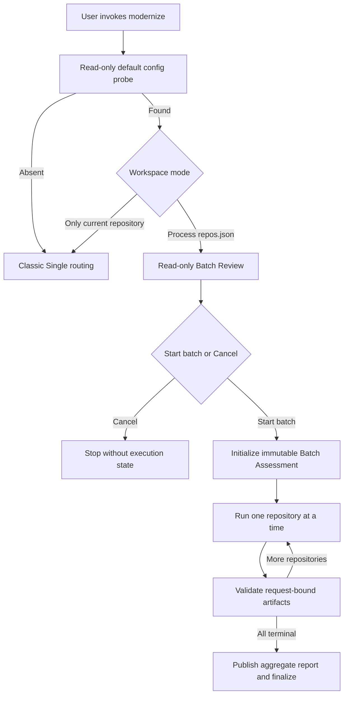

# Batch Assessment Design

> Status: Assessment-only design baseline
>
> Updated: 2026-08-19
>
> Product principle: Batch reuses the existing Single Assessment behavior. It must not create a second modernization platform or use Batch as a reason to redesign Single.

## 1. Decision Summary

This design covers one capability only: local, sequential Batch Assessment for whole repositories.

1. `modernize` remains the only user-invocable entry point.
2. When the default `.github/modernize/repos.json` exists, the first user-visible question selects Batch or classic Single mode.
3. Batch selection does not approve execution. A read-only Review is followed by a separate **Start batch** or **Cancel** decision.
4. Each selected repository runs the existing plugin-owned Assessment in a fresh `batch-assessment` invocation.
5. Repositories run sequentially. Correctness never depends on cross-repository concurrency.
6. Repository-local HTML, compatibility JSON, facts, memory, and AppCAT outputs retain the Single locations and formats.
7. Finalization publishes a user-facing `assessment/reports-<timestamp>/` tree and keeps private control state under `batches/<batch-id>/`.
8. Persisted request/result/validation records, artifact digests, lease ownership, atomic state, and crash-consistent finalization are retained because they are already implemented and protect delivered results.

This document does not plan Batch Planning, Batch Execution, a complete modernization pipeline, retry waves, cross-session resume, takeover scheduling, normal pause, cloud delegation, `include_paths` execution, app output distribution, or cross-repository concurrency. Those capabilities require a separate future proposal if product requirements change.

## 2. Single Assessment Baseline

Batch parity is measured against the current Single Assessment, not against speculative Batch features.

Single Assessment currently provides:

- Java, .NET, JavaScript, and TypeScript detection;
- language-specific default domains;
- explicit domains and `issue-only` or `full` coverage;
- target/runtime options: `targetRuntime`, `targetComputeServices`, `enableContainerization`, and `targetOS`;
- security options: `minimumCveSeverity` and `cveScanScope`;
- AppCAT or npm-check-updates execution without modifying source/build manifests;
- six full-coverage fact documents and seven security tasks;
- versioned self-contained HTML and Planning-compatible `report.json`;
- finding counts by severity/state and a top recommendation;
- `success`, `partial`, `cancelled`, and `failed` return semantics;
- repository-local findings history across separate runs.

Single Assessment does not resume an interrupted Assessment invocation. The `modernize` “continue the migration” workflow only detects completed artifacts and starts the next phase. A new Assessment request creates a new run.

Therefore in-flight resume, pause, and retry are not Batch Assessment parity requirements.

## 3. Product Boundary

### 3.1 Supported

- Local execution in the current Copilot CLI session.
- Whole-repository execution units only.
- Java, .NET, JavaScript, and TypeScript repositories.
- Explicit repository selection from `repos.json`.
- Read-only preflight and explicit approval.
- Sequential processing with continuation after a repository failure.
- Request-bound result validation and aggregate delivery.
- User cancellation before **Start batch**.

### 3.2 Not Supported

- Batch Planning or Batch Execution.
- Full Assessment → Planning → Execution Batch workflows.
- Cloud Agent delegation or remote execution.
- `include_paths` execution units. Configurations containing them fail before control state is created.
- A mixed-language execution unit until it is either correctly decomposed or deterministically rejected. Silently selecting the first language is not valid.
- Mid-run normal cancellation, pause, retry, or resume.
- Scheduling after lease takeover.
- Cross-repository parallelism.
- `apps[].output` distribution.
- Batch rearchitecture, deployment, upgrade, migration, or remediation.

Existing schemas or helper primitives for deferred capabilities are inert implementation details. Their presence does not make those capabilities part of the product contract and creates no plan to activate them.

## 4. Entry And Approval Flow



Rules:

- The mode question precedes all action routing whenever the default config exists.
- Exact fallback text is accepted only on the immediately following turn when structured elicitation is unavailable.
- Review creates no manifest, lease, attempts, or approval-bearing state.
- **Start batch** is bound to the reviewed paths, selection, decisions, and digests.
- A failed Batch operation never falls back to parent-agent Assessment work.

## 5. Repository Configuration

The resolver accepts the existing v1 array and v2 object forms of `repos.json`.

Supported repository fields:

| Field | Behavior |
|---|---|
| `name` | Required stable repository identity after sanitization. |
| `url` | HTTPS/SSH source; credentials, query, and fragment are never persisted. |
| `path` | Local repository path resolved against the launch root. |
| `branch` | Verified during preflight for configured Git repositories. |
| `include_paths` | Parsed for compatibility but rejected by Stage 1B before initialization. |
| `apps` | Preserved as grouping metadata in the aggregate report. |
| `apps[].output` | Not executed or distributed. |

Preflight classifies repositories as Ready, Needs attention, Clone required, or Blocked. Blocked units cannot be selected. Needs-attention units require explicit approval in the Review.

## 6. Assessment Decisions

Every attempt request must contain its effective Assessment configuration. The effective configuration is derived per execution unit from:

1. explicit user constraints; otherwise
2. the same language-specific defaults used by Single Assessment.

The Batch contract must carry all Single Assessment fields listed in Section 2. Until that parity is implemented, Batch must not silently drop explicit fields.

`maxConcurrency` applies only to the fact/security waves inside one repository. Cross-repository scheduling remains sequential.

For execution units with more than one detected language, Stage 1B must fail closed until deterministic decomposition is implemented. The current `languages[0]` behavior is not an accepted design.

## 7. Attempt And Validation Contract

Each repository receives one immutable first attempt in Stage 1B:

```text
<batch-root>/attempts/<repo>/<unit>/assessment/1/
├── request.json
├── result.json
├── validation.json
└── scratch/
```

The request binds:

- batch, repository, execution-unit, invocation, phase, and attempt identities;
- canonical workspace and scope roots;
- deterministic run ID and language;
- original user request and explicit approval;
- the complete effective Assessment configuration;
- result path.

Successful or partial results require:

- `artifactValidation: passed`;
- compatibility report schema and request-bound run/language/domain identity;
- embedded HTML payload with the same identity and counts;
- AppCAT evidence when required;
- all six facts for full coverage;
- terminal data for all selected security tasks;
- canonical paths contained in the workspace or attempt root;
- persisted SHA-256 digests.

Missing, malformed, stale, mismatched, or fabricated evidence becomes `ProtocolError`. Agent prose is never completion evidence.

## 8. Control State

Private state is stored under:

```text
.github/modernize/batches/<batch-id>/
├── review.json
├── REVIEW.md
├── manifest.json
├── state.json
├── events.jsonl
├── finalization.json
├── summary.json
├── summary.md
├── attempts/
└── repos/
```

A private lease-session worker retains the raw owner token in memory. Persisted state contains only its digest. Only one owner may mutate a batch.

Implemented takeover/CAS primitives remain read-only for product behavior. A stale or interrupted batch is not resumed. The user starts a new Batch Assessment if another run is required.

Start, commit, and finalization replay the same immutable identity after a local persistence fault. This crash consistency completes one invocation; it is not user-facing resume.

## 9. User-Facing Reports

Canonical repository artifacts stay in their Single locations. Finalization copies only digest-verified snapshots into:

```text
.github/modernize/assessment/reports-<timestamp>/
├── index.html
├── aggregate-report.json
└── repos/
    └── <repository-identity>/
        ├── report.json
        ├── report.html
        └── facts/
```

The outer layout and shared top-level aggregate fields align with the Modernization CLI. Plugin-specific data is stored under `extensions.github-copilot-modernization` instead of inventing unrelated top-level concepts.

The report tree is built in a same-volume temporary directory and atomically renamed. The finalization journal binds the directory, index, and aggregate digests. A conflict or digest change fails closed before lease release.

The TUI presents `index.html` first. The private `summary.md` is secondary diagnostics, not the path users must discover.

Aggregate delivery must reach Single summary parity by including deterministic severity/state counts and top recommendations. Canonical repository reports remain the source for future Single Planning; Batch Planning is not part of this design.

## 10. Result Semantics

Repository terminal states:

| State | Meaning |
|---|---|
| `Completed` | Required Assessment artifacts are valid. |
| `Completed with issues` | Usable reports exist, with validated partial/degraded work. |
| `Failed` | No usable result was produced. |
| `ProtocolError` | Child completion lacked valid request-bound evidence. |
| `Interrupted` | Internal evidence that an invocation lacked a terminal commit; not resumable in Stage 1B. |

Batch terminal states:

| State | Meaning |
|---|---|
| `Completed` | Every executed repository completed. |
| `Completed with issues` | At least one usable result exists and another repository was partial or failed. |
| `Failed` | No repository produced a usable result, or initialization was structurally blocked. |

No progress/retry-wave semantics are defined because retry is outside scope.

Cancel before **Start batch** is a conversational outcome, not a persisted Batch terminal state. It creates no manifest, state, lease, attempts, or user report.

## 11. Remaining Release Work

Assessment parity is implemented: explicit configuration is request/report/aggregate-bound, defaults are resolved per language, mixed-language units fail closed, and validated Single report payloads drive aggregate summary semantics.

Only product-host evidence refresh remains: current-package Windows and POSIX supported scenarios plus current-package real-repository acceptance.

Permission-event fault injection is useful diagnostic coverage but is not a product feature or release requirement when the ACP host does not expose a target-identifiable nested-agent permission request. Deterministic control-plane tests remain required for missing results and partial aggregation.

## 12. Acceptance Criteria

- Single mode routing, defaults, reports, and phase progression remain unchanged.
- Every explicit Single Assessment option has the same meaning in Batch.
- Mixed-language input never silently loses a language.
- Two whole repositories complete sequentially through the packaged production-agent chain.
- One repository can fail while a later repository completes, with truthful aggregate state.
- Cancel before Start creates no approval-bearing execution state or user report.
- Every successful report snapshot matches a validated canonical artifact digest.
- Final TUI output links the aggregate `index.html` before private diagnostics.
- Current-package Windows and POSIX evidence pass supported product scenarios.
- Full `*.test.mjs` regression has zero failures; skips have an explicit platform reason.

## 13. Non-Goals

- Modifying or refactoring Single Assessment.
- Batch Planning, Execution, or full modernization.
- Retry, resume, pause, abandon, or takeover scheduling.
- Reopening `include_paths`.
- Cross-repository parallel execution.
- Cloud or remote execution.
- App report distribution.
- Batch-specific telemetry architecture or a new feature-flag framework.
- Worker certification, depth-safe rearchitecture, or deployment orchestration.
